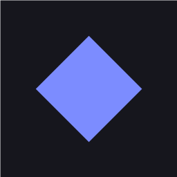

<div align="center">



# ⚡ Anode

**A Claude-native code editor built from scratch — not on VS Code.**

[](https://gheat.net/anode)
[](https://gheat.net/anode)
[](https://gheat.net/anode)
[](https://gheat.net/anode)

[](https://tauri.app)
[](https://react.dev)
[](https://typescriptlang.org)
[](https://rust-lang.org)

**[⬇ Download for Windows](https://gheat.net/anode)** · **[🌐 Website](https://gheat.net/anode)** · **[📖 Docs](#-architecture)**

---

*The editor your AI actually lives in.*

</div>

---

## ✨ What Makes Anode Different

> Most AI editors bolt an LLM onto VS Code. Anode is built from the ground up for **Claude Code** — the real CLI, running in a real PTY, with no API key, no wrappers, no compromises.

<table>
<tr>
<td width="50%">

### 🤖 Real Claude Code
The actual `claude` binary runs in an embedded terminal. Your existing session, your `.claude` folder, your permissions — all inherited. Zero configuration.

</td>
<td width="50%">

### 🎨 Native Windows Acrylic
Genuine Windows 11 acrylic blur via DWM — not a CSS hack. The editor breathes with your desktop.

</td>
</tr>
<tr>
<td width="50%">

### ⚡ Built with Tauri 2 + Rust
~8 MB installer. Microsecond startup. The Rust core handles filesystem, git, PTY, and GitHub OAuth — no Electron, no Node.js runtime.

</td>
<td width="50%">

### 🌈 Deep Theme System
Seven built-in palettes. Full custom palette editor. Per-accent theme generation. Saved palettes. Everything driven by CSS variables — swap a theme and every pixel repaints instantly.

</td>
</tr>
</table>

---

## 🗂 Feature Map

| Feature | Status | Notes |
|---------|:------:|-------|
| 🤖 Embedded Claude Code CLI | ✅ | Real `claude` binary in a PTY — no API key |
| 🎨 Theme & palette system | ✅ | CSS-variable driven, 7 presets + custom |
| 🌫️ Windows acrylic blur | ✅ | Native DWM acrylic via `window-vibrancy` |
| ✍️ Smooth animated caret | ✅ | Custom CodeMirror 6 `ViewPlugin` |
| 🔀 Split editor | ✅ | Side-by-side panes with independent scroll |
| 📁 Project switcher | ✅ | Activity bar rail, emoji/image icons, instant switch |
| 🔍 Markdown preview | ✅ | Obsidian-style render — markdown-it + tasks/anchors |
| 🔢 Line numbers & diagnostics | ✅ | Gutter + error/warning underlines |
| 🐙 GitHub Source Control | ✅ | Commit, sync, push/pull, branch info, OAuth device flow |
| 🔒 GitHub OAuth sign-in | ✅ | Device flow, built-in client ID, no setup needed |
| 🖥️ Integrated terminal | ✅ | PTY shell (PowerShell/zsh/bash) at the bottom |
| 🖼️ Project icons | ✅ | 40 emojis, tint colors, or upload PNG/SVG |
| 🔌 Settings cloud sync | ✅ | Self-hosted backend at `gheat.net/anode` |
| 🖋️ Typography controls | ✅ | Interface + editor font, base size |
| 🌐 macOS / Linux | ✅ | Solid surfaces (acrylic is Windows-only) |

---

## 🚀 Quick Start

### Prerequisites

| Requirement | Details |
|-------------|---------|
|  | JavaScript runtime |
|  | Tauri's native core |
|  | `claude` on your PATH |
|  | Ships with Windows 11 |

```powershell
npm install        # install JS dependencies (once)
npm run app        # launch Anode — compiles Rust on first run (~2–3 min)
```

> **Tip:** The first `cargo` compile takes a few minutes. Every launch after that is instant with hot-reload on the frontend.

**Frontend-only preview** (no native features — Claude/git/blur are stubbed):
```powershell
npm run dev        # open http://localhost:1420 in a browser
```

---

## 📦 Download & Install

<div align="center">

**[⬇ Download Anode.exe for Windows → gheat.net/anode](https://gheat.net/anode)**

</div>

### 🪟 Windows
Download `Anode.exe` from [gheat.net/anode](https://gheat.net/anode) and run it.

> On the SmartScreen prompt: **More info → Run anyway** (unsigned, not unsafe — code signing requires the paid Microsoft EV certificate program).

### 🍎 macOS (unsigned)
macOS Gatekeeper blocks unsigned apps on first launch. One of two fixes:

```bash
# Option A — right-click Anode.app → Open → Open (only needed once)

# Option B — strip quarantine flag
xattr -cr /Applications/Anode.app
```

> If you see *"Anode is damaged"* that's the quarantine flag — `xattr -cr` fixes it.

### 🐧 Linux
Install the `.deb`/`.rpm` with your package manager, or run the `.AppImage` directly:

```bash
chmod +x Anode_1.3.3_amd64.AppImage
./Anode_1.3.3_amd64.AppImage
```

A compositor (standard on GNOME/KDE) is required for transparent rounded corners.

---

## 🏗 Build from Source

> Tauri does **not** cross-compile — build on the OS you want to target.

```bash
npm install
npm run app:build    # → src-tauri/target/release/bundle/
```

Output per OS:

| OS | Artifact |
|----|----------|
| Windows | `nsis/Anode_1.3.3_x64-setup.exe` + `.msi` |
| macOS | `dmg/Anode_1.3.3_aarch64.dmg` + `macos/Anode.app` |
| Linux | `deb/*.deb` · `appimage/*.AppImage` · `rpm/*.rpm` |

**Linux build prerequisites:**
```bash
sudo apt-get install -y libwebkit2gtk-4.1-dev libgtk-3-dev librsvg2-dev \
  libssl-dev build-essential curl
```

**Type-check & verify (no full build):**
```bash
npx tsc --noEmit              # frontend
npx vite build                # bundle
cd src-tauri && cargo check   # Rust
```

---

## 🏛 Architecture

```
┌─────────────────────── WebView (React + TypeScript) ───────────────────────┐
│                                                                             │
│   App.tsx ── layout, keybindings, blur/theme sync                          │
│    ├─ TitleBar ── MenuBar (File / Edit / View / Terminal / Help)           │
│    ├─ ActivityBar ── project switcher · view toggles · tool buttons        │
│    ├─ Sidebar ── Explorer (FS tree) │ SourceControl (git + GitHub)         │
│    ├─ EditorArea ── tabs · EditorPane(s) · MarkdownPreview                 │
│    │               └─ TerminalPanel (shell PTY)                            │
│    ├─ ClaudePanel ── the real Claude Code CLI in xterm.js                  │
│    └─ SettingsPanel · SetupWizard                                          │
│                                                                             │
│   zustand store ── persisted to localStorage (settings + workspace)        │
│   lib/tauri.ts ── typed invoke() wrappers + event listeners                │
└────────────────────────────────┬────────────────────────────────────────────┘
                                 │  Tauri IPC (commands + events)
┌────────────────────────────────┴────────────────────────────────────────────┐
│  src-tauri/src/lib.rs (Rust)                                                │
│   • Window    — acrylic blur (DWM), rounded corners (DWM DWMWA attr)       │
│   • FS        — read_dir / read_file / write_file / read_image_data_url    │
│   • Git       — shells to system git; reuses the OS credential manager     │
│   • GitHub    — OAuth device flow via reqwest (client ID baked in)         │
│   • PTY       — PtyManager (portable-pty); streams pty://output events     │
└─────────────────────────────────────────────────────────────────────────────┘
```

### 🗃 Stack at a Glance

| Layer | Technology | Why |
|-------|-----------|-----|
| Desktop shell | **Tauri 2** (Rust) | ~8 MB installer, native WebView, no Electron |
| Frontend | **React 19** + **TypeScript** + **Vite 6** | Fast iteration, strict types |
| Code editor | **CodeMirror 6** | Modular, not VS Code; enables the custom animated caret |
| Terminal | **xterm.js** + **FitAddon** | Battle-tested PTY rendering |
| State | **zustand** + `persist` | Tiny, selector-based, localStorage sync |
| Markdown | **markdown-it** | Fast, pluggable (task lists, anchors) |
| PTY | **portable-pty** (Rust) | Cross-platform pseudo-terminal |
| HTTP | **reqwest** (Rust) | GitHub OAuth device flow |
| Native effects | **window-vibrancy** | Windows acrylic; DWM FFI for rounded corners |

---

## 🔑 GitHub Sign-In

The Source Control panel auto-detects git and offers **Initialize Repository**, a commit box, and **Sync** as appropriate.

**OAuth device flow** — works out of the box, no setup:

1. Open the Source Control panel → **Sign in with GitHub**
2. Anode shows a short code and opens `github.com/login/device`
3. Enter the code, authorize — done

Anode's OAuth app client ID is built in (client IDs are public; the device flow has no secret). To use your own OAuth app:

```powershell
$env:ANODE_GITHUB_CLIENT_ID = "Ov23xxxxxxxx"
npm run app
```

Push/pull also work through the **system Git Credential Manager** even without signing in — it prompts a browser login on first use.

---

## ⌨️ Keyboard Shortcuts

| Shortcut | Action |
|----------|--------|
| `Ctrl+S` | Save focused file |
| `Ctrl+W` | Close active tab |
| `Ctrl+B` | Toggle sidebar |
| `` Ctrl+` `` | Toggle integrated terminal |
| `Ctrl+J` | Toggle Claude panel |
| `Ctrl+,` | Open Settings |
| `Ctrl+\` | Toggle split editor |

---

## 📁 Project Layout

```
Anode Code Editor/
├── src/
│   ├── App.tsx                  # app shell + layout + keybindings
│   ├── state/store.ts           # zustand: settings + workspace + persist
│   ├── styles/
│   │   ├── themes.ts            # 7 theme presets + palette generators
│   │   └── global.css           # all styling — CSS variables everywhere
│   ├── editor/
│   │   ├── setup.ts             # CodeMirror extensions + language support
│   │   ├── smoothCaret.ts       # animated caret (ViewPlugin)
│   │   └── linter.ts            # demo diagnostics → underlines
│   ├── components/
│   │   ├── ClaudePanel.tsx      # Claude Code CLI panel
│   │   ├── TerminalPanel.tsx    # integrated shell
│   │   ├── SourceControl.tsx    # git + GitHub UI
│   │   ├── SettingsPanel.tsx    # themes, fonts, sync
│   │   └── ...                  # TitleBar, Sidebar, EditorArea, etc.
│   └── lib/
│       ├── tauri.ts             # typed Rust command wrappers
│       └── actions.ts           # save, open folder, editor commands
└── src-tauri/
    ├── src/lib.rs               # blur, fs, git, GitHub OAuth, PTY
    └── tauri.conf.json          # frameless transparent window
```

---

## 📝 Cross-Platform Notes

- **Acrylic blur is Windows-only** — macOS/Linux use solid surfaces (exact colors)
- **Regenerate icons** after logo changes: `npm run tauri -- icon path/to/1024.png`
- **Build on the target OS** — Tauri does not cross-compile
- `claude` and `git` must be on PATH; Claude inherits your existing CLI login

---

<div align="center">

**[⬇ Download → gheat.net/anode](https://gheat.net/anode)**

Made with ⚡ by [Gheat](https://gheat.net) · © 2026 Gheat

</div>
